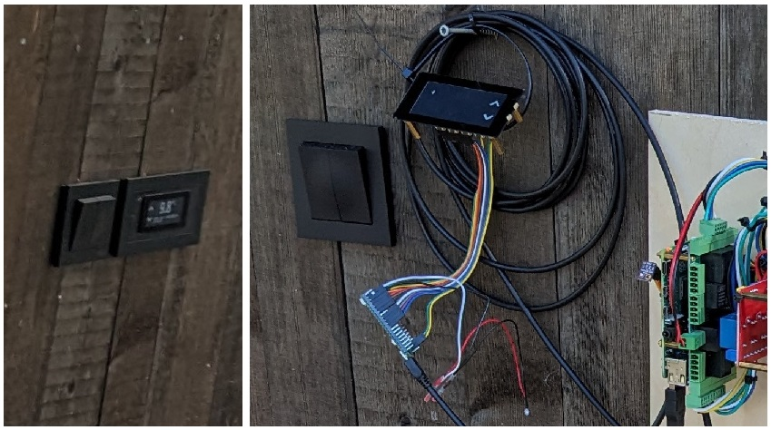
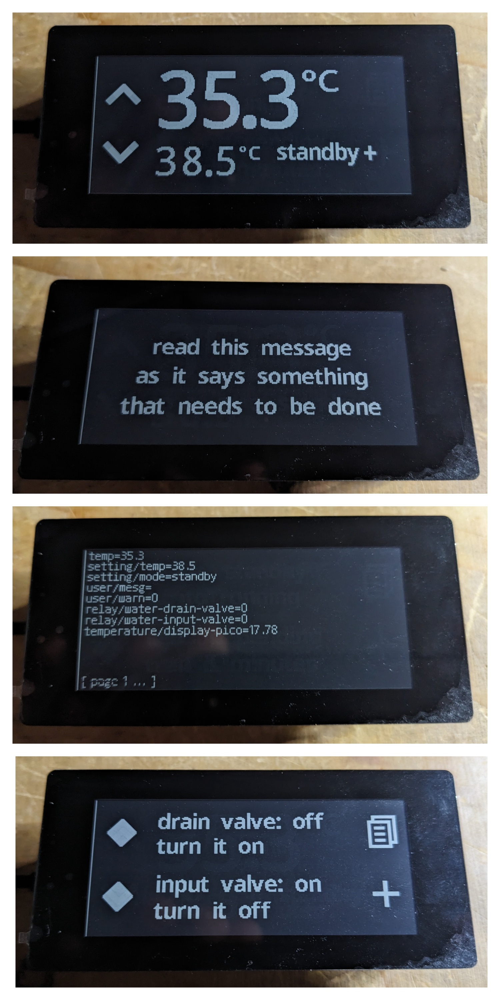

# pico_display

Pico display slave on a Waveshare 2.9inch Touch e-Paper Module (2023)

Raspberry PI pico is USB connected to (and powered by) a Raspberry PI host
which runs a `nodejs` server for communication using a local `etcd3`
server for inter component communication. The system is a proprietary 
hot tub controller and this is the external interface. ePaper was chosen
for the high contrast, not for power saving.

You need to install PICO SDK in ~/third_party directory and the rest
should be straight forward. The host system components are in the `system`
directory, with as `test.js` as a test interface, and `main.js` as the
production interface.

Note the LED wired to GPIO 14 which provides a blinking indication that
a warning message needs to be read, which can be read by double tapping
the screen. The screen has position for four buttons. On the main screen
these control the setpoint and operating mode. The third button on the
main screen is hidden but renders the control menu, which is a list of 
configurable actions (delivered from host) plus access to a diagnostic
dump from the etcd3 server.

See https://www.waveshare.com/Pico-CapTouch-ePaper-2.9.htm and https://www.waveshare.com/wiki/Pico-CapTouch-ePaper-2.9.
