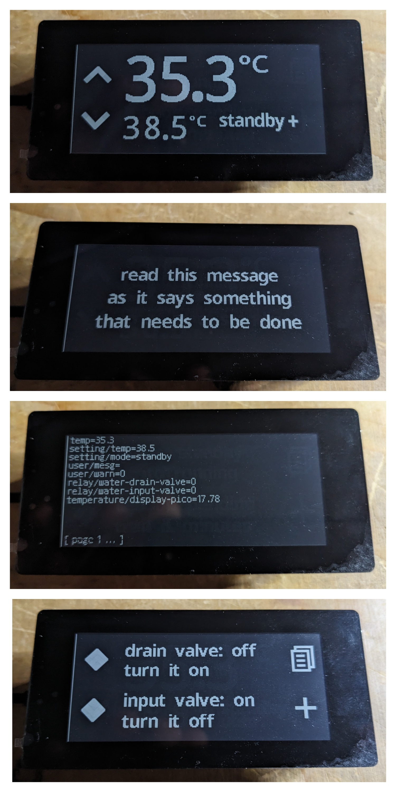
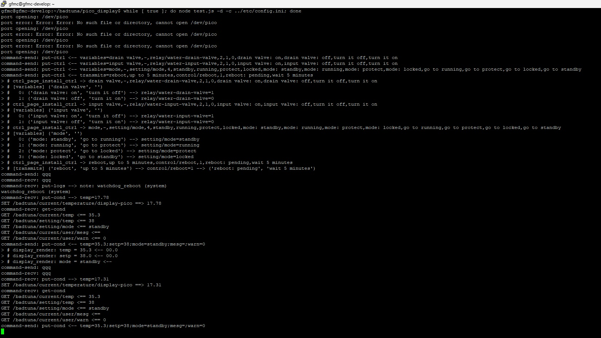

# pico_display

Pico display slave on a Waveshare 2.9inch Touch e-Paper Module (2023)

`Raspberry Pi Pico` (with the `Waveshare 2.9 inch Touch e-Paper` module as a hat) is USB connected to (and powered by) a `Raspberry Pi` host
which runs a `nodejs` server for communication using a local `etcd3`
server for inter component communication. The system is a proprietary 
hot tub controller and this is the outside wall interface (there is also a http interface). ePaper was chosen
for the high contrast, not for power saving. The unit is mounted in a 2 gang faceplate matching that of the
build.

Install `Pico SDK` in `~/third_party` directory and the rest
should be straight forward `CMake` process (with `make install` using `picotool` to automatically upload the image). 
The host system components are in the `system` directory, with as `test.js` as a test interface, 
and `main.js` as the production interface. Run the test interface as `while [ true ]; do node -d -c config.ini test.js; done`
as the `/dev/pico` device will disappear once `picotool` puts into `BOOTSEL` mode. This has the benefit
of reloading `test.js` for any host side changes.

Note the LED is wired to `GPIO 14` to provide a visible blinking indication that
a warning message needs to be read, which is done so by tapping
the centre of the screen. The design is such that the screen is laid out with area for four buttons. On the main screen
these control the setpoint (up, down) and the operating mode (running / standby). The third button on the
main screen is hidden but renders a control menu, which is a list of 
configurable actions (uploaded from host) and access to a diagnostic
dump from the `etcd3` server. Changes to any variables are only
confirmed once reflected back from the host, thus modes and settings
and controls are enforced in the host. The `Pico` has an internal 
temperature sensor which is also sampled and downloaded to the host.

This particular Waveshare device was chosen because it has a touch interface, is an approprtiat size, has a protective
screen layer, is built for the Pico, and has a fast partial refresh rate (3 seconds) with low ghosting. The four physical
buttons are not used.

See https://www.waveshare.com/Pico-CapTouch-ePaper-2.9.htm and https://www.waveshare.com/wiki/Pico-CapTouch-ePaper-2.9.
